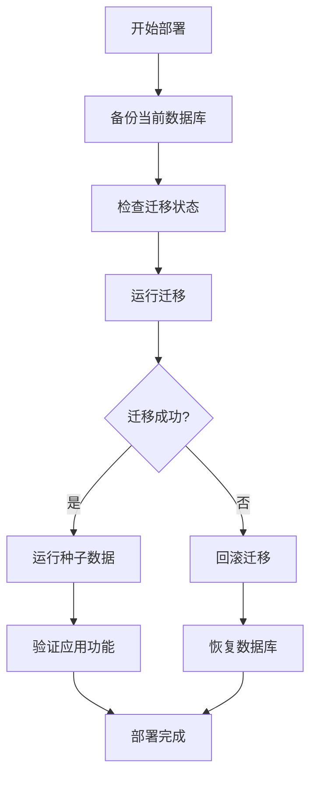

# Laravel工单系统数据库迁移指南

## 🎯 迁移vs SQL导入的优势

### 为什么使用Laravel迁移？

1. **版本控制**
   - 每个数据库结构变更都有时间戳文件名
   - 可以追踪数据库结构的演变历史
   - 团队协作时不会丢失数据库变更

2. **增量更新**
   - 只运行新的迁移，不影响现有数据
   - 自动检测已运行的迁移
   - 避免重复执行相同的操作

3. **回滚能力**
   - 可以安全地回滚到之前的数据库版本
   - 出现问题时可以快速恢复
   - 支持分步回滚

4. **环境适应**
   - 自动适应不同的数据库类型
   - 处理数据库特定的语法差异
   - 支持MySQL、PostgreSQL、SQLite等

5. **团队协作**
   - 迁移文件可以纳入Git版本控制
   - 开发者可以审查数据库变更
   - 部署时自动应用所有必要的变更

## 📁 迁移文件结构

```
database/
├── migrations/
│   ├── 2024_11_17_000001_update_users_table_for_workorder.php
│   ├── 2024_11_17_000002_create_departments_table.php
│   ├── 2024_11_17_000003_create_workorder_types_table.php
│   ├── 2024_11_17_000004_create_workorders_table.php
│   ├── 2024_11_17_000005_create_workorder_logs_table.php
│   ├── 2024_11_17_000006_create_workorder_attachments_table.php
│   ├── 2024_11_17_000007_create_workorder_visits_table.php
│   └── ... (其他迁移文件)
└── seeders/
    ├── DatabaseSeeder.php
    ├── AdminUserSeeder.php
    ├── DepartmentSeeder.php
    └── ...
```

## 🔧 迁移命令详解

### 基本命令

```bash
# 运行所有待执行的迁移
php artisan migrate

# 在生产环境中强制运行
php artisan migrate --force

# 查看待运行的迁移状态
php artisan migrate:status

# 查看迁移历史
php artisan migrate:status --show=database
```

### 高级命令

```bash
# 运行特定的迁移文件
php artisan migrate --path=database/migrations/2024_11_17_000001_update_users_table_for_workorder.php

# 运行特定步骤的迁移
php artisan migrate --step=5

# 回滚最后一个迁移
php artisan migrate:rollback

# 回滚多个步骤
php artisan migrate:rollback --step=3

# 回滚到特定迁移
php artisan migrate:rollback --to=2024_11_17_000003_create_workorder_types_table

# 重置所有迁移（开发环境）
php artisan migrate:fresh

# 重置并运行种子数据
php artisan migrate:fresh --seed
```

## 📊 迁移状态解读

### migrate:status 输出示例

```
+-----------------------------------------------------+-------+-------+------+-----+
| Migration                                   | Batch | Notes | Type |
+-----------------------------------------------------+-------+-------+------+
| 2024_11_17_000001_update_users_table     | 1     | Down | Core |
| 2024_11_17_000002_create_departments_table | 1     | Up   | Core |
| 2024_11_17_000003_create_workorder_types_table | 1     | Up   | Core |
| 2024_11_17_000004_create_workorders_table     | 1     | Up   | Core |
+-----------------------------------------------------+-------+-------+------+
```

**状态说明**：
- **Up**：已执行
- **Down**：已回滚
- **Pending**：待执行
- **Failed**：执行失败

## 🌱 种子数据管理

### 种子数据类型

1. **基础数据**：系统运行必需的基础数据
2. **测试数据**：开发和测试环境使用的示例数据
3. **配置数据**：系统配置和默认设置

### 种子命令

```bash
# 运行所有种子数据
php artisan db:seed

# 运行特定的种子类
php artisan db:seed --class=AdminUserSeeder

# 强制运行种子数据
php artisan db:seed --force

# 重新运行迁移并种子数据
php artisan migrate:fresh --seed
```

### 种子文件结构

```php
<?php

namespace Database\Seeders;

use Illuminate\Database\Seeder;

class ExampleSeeder extends Seeder
{
    public function run(): void
    {
        // 创建数据
        DB::table('example')->insert([
            'name' => '示例数据',
            'created_at' => now(),
            'updated_at' => now(),
        ]);
        
        // 使用模型创建数据
        ExampleModel::create([
            'name' => '示例模型',
        ]);
        
        // 调用其他种子
        $this->call(OtherSeeder::class);
    }
}
```

## 🚨 常见问题和解决方案

### 1. 迁移失败

**问题**：`Class 'foo' not found`
```bash
# 解决方案：检查类名和命名空间
php artisan migrate:status
composer dump-autoload
```

**问题**：`SQLSTATE[HY000]: General error`
```bash
# 解决方案：检查数据库连接和权限
php artisan tinker
>>> DB::connection()->getPdo();
```

**问题**：迁移卡住
```bash
# 解决方案：检查数据库锁定
php artisan migrate --force
# 或分步执行
php artisan migrate --step=1
```

### 2. 种子数据失败

**问题**：外键约束错误
```bash
# 解决方案：检查数据依赖关系
php artisan db:seed --class=ProblemSeeder
# 在种子文件中使用模型事件
```

**问题**：重复数据错误
```bash
# 解决方案：使用firstOrCreate
Model::firstOrCreate(['email' => 'test@example.com'], $data);
```

### 3. 生产环境问题

**问题**：生产环境执行迁移
```bash
# 解决方案：使用强制标志
php artisan migrate --force

# 备份数据库
mysqldump -u username -p database_name > backup.sql
```

## 🔒 生产环境最佳实践

### 1. 部署前准备

```bash
# 1. 备份当前数据库
mysqldump -u username -p database_name > pre_deploy_backup.sql

# 2. 检查迁移状态
php artisan migrate:status

# 3. 测试迁移（在预发布环境）
php artisan migrate --dry-run
```

### 2. 部署时执行

```bash
# 1. 运行迁移
php artisan migrate --force

# 2. 检查迁移结果
php artisan migrate:status

# 3. 运行种子数据（仅新部署）
php artisan db:seed --force
```

### 3. 部署后验证

```bash
# 1. 验证表结构
mysql -u username -p -e "DESCRIBE users;"

# 2. 验证数据完整性
php artisan tinker
>>> User::count();
>>> Department::count();

# 3. 测试应用功能
curl -X GET http://your-domain.com/api/test
```

## 📋 迁移检查清单

### 部署前检查
- [ ] 备份当前数据库
- [ ] 检查迁移文件完整性
- [ ] 验证数据库连接
- [ ] 测试迁移（预发布环境）

### 部署中检查
- [ ] 迁移执行无错误
- [ ] 种子数据导入成功
- [ ] 数据库表结构正确
- [ ] 索引和约束创建成功

### 部署后检查
- [ ] 应用功能正常
- [ ] 数据完整性验证
- [ ] 性能测试通过
- [ ] 回滚计划准备

## 🔄 迁移工作流程



## 📚 相关资源

- [Laravel官方文档 - 数据库迁移](https://laravel.com/docs/11.x/migrations)
- [Laravel官方文档 - 数据库种子](https://laravel.com/docs/11.x/seeding)
- [数据库迁移最佳实践](https://laravel-news.com/database-migrations-best-practices)

---

**🎉 使用Laravel迁移和种子系统，您可以安全、可靠地管理数据库结构变更，支持团队协作和版本控制！**